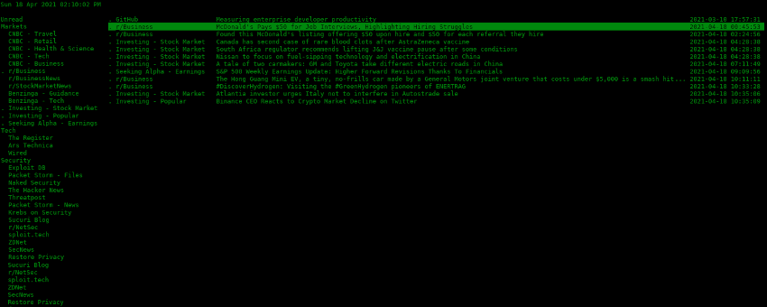

## termrea

A terminal RSS reader heavily based on `liferea`.



### Purpose

My favorite RSS reader is liferea, but I needed the terminal feeling. I love the terminal.  
That is what made me create termrea.

### How it works

This application utilizes two main elements of liferea:

- the configuration file `feedlist.opml` which contains the RSS feeds and their tree structure,
- the database `liferea.db` which contains the news items.

Also, currently the feed fetching mechanism of liferea is used, which means that liferea has to run  
along with termrea. I prefer to run it on a [framebuffer](https://github.com/mylk/tools/blob/master/liferea-xvfb.sh), instead of the actual X session.

Last but not least, currently to manage the RSS feeds (create only) you have to use liferea.

What termrea does by its own:

- present the news items and navigate through them,
- present the feed sources and navigate through them,
- toggle news items between read / unread,
- mark sources and groups of sources as read,
- edit sources,
- delete sources,
- and, of course open news items to your browser :-)

### The goal

The goal for termrea is to have its own feed fetching and source manipulation mechanisms.  
The other shared aspects (the configuration file and the database), I think are okay and I like the  
idea of the applications being somewhat interchangeable.

Anyway, the [OPML](https://en.wikipedia.org/wiki/OPML) format used by liferea to define the feed sources, is the de facto  
standard to define RSS feed lists.

### Run

Clone the project, head to the project's root directory and run:

```
cd termrea/
termrea
```

### Controls

| Key     | Description                         |
| :-----: | :---------------------------------- |
| ↑ ↓ ← → | navigate                            |
| r       | mark as read                        |
| u       | mark as unread                      |
| enter   | open item on browser, select source |
| space   | show unread of select source        |
| f       | update list                         |
| e       | edit source                         |
| d       | delete source                       |
| h       | help                                |
| q       | quit                                |

### Configure

Edit `termrea/config.py` to point to the configuration file and database.  
Don't worry, the defaults are already set in there.

